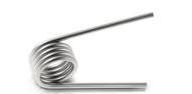
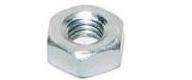
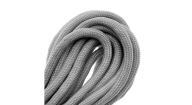

# Freeskate Holder

This is a design for a freeline skate holder that:

- is mounted underneath a backpack
- can be operated behind your back without taking off your backpack
- can be operated with a single hand per skate
- confirms successful insertion with a loud click
- uses a spring-loaded latch to hold the skates securely in place
- uses a thumb-pressed lever to trigger gravity-assisted ejection
- can be printed with any 3d printer or online 3d print service
- is free and open source
- is made with OpenSCAD

One of the amazing things about freeline skates is their portability.
The main idea of this holder is to leverage that portability and provide an extremely fast way to stash and retrieve a pair of freeline skates
from your backpack.

As of May 2020, printing the holder in ordinary PLA or PETG filament using an online 3d print service costs about 60 EUR + shipping (at 20% infill, which is plenty).

## Non-printed parts

-  2x torsion spring from laundry peg
-  2x 35mm M3 bolt
-  2x M3 nut
-  some cord/rope (to tie the holder underneath the backpack)

## Generating STL files

Install OpenSCAD and run:

    ./build.sh

This will create `frame.stl` and `clip.stl`.

## Limitations

For now, the dimensions of the holder are fine-tuned for JMK freeline skates that have the rubber brackets attached to them,
and the holder doesn't work well for skates from other brands or JMK skates that don't have the rubber brackets.
Later, I'll add versions of the holder with dimensions fine-tuned for skates from other brands and for JMK skates that don't have the rubber brackets.
